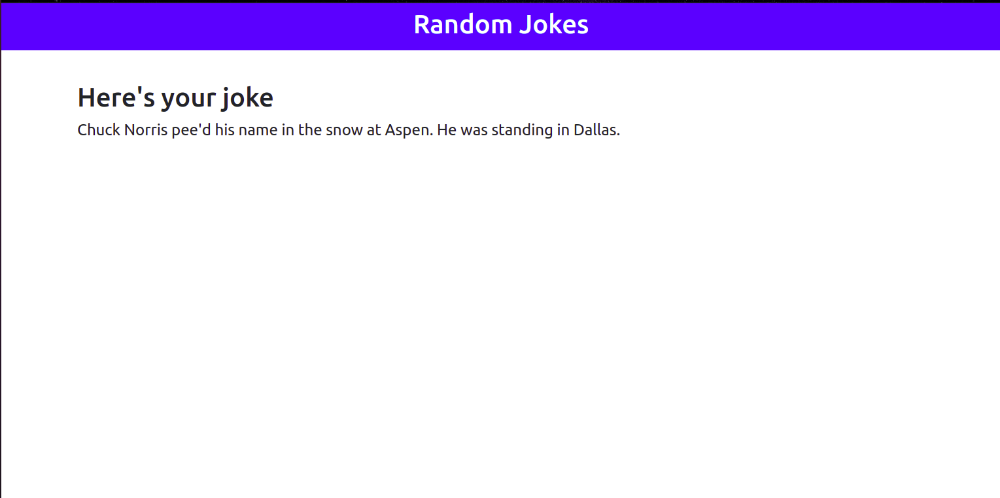

# Django Project
## Django project pulling data from Chuck Norris Joke Api.

## Visit live website
## Requirements
## Please read the requirements.txt file

## Getting Started
These instructions will get you a copy of the project up and running on your local machine for development and testing purposes.

# Installing
```
open terminal and type
git clone https://github.com/j23747/Djangoproject.git
```


# or simply download using the url above

## To migrate the database open terminal in project directory and type
```
python manage.py makemigrations
python manage.py migrate
To use admin panel you need to create super user using this command
python manage.py createsuperuser
To run the program in local server use the following command
python manage.py runserver
Then go to http://127.0.0.1:8000 in your browser
```


### Project snapshot




### Author

**Josphat Mwania**

**Email: josphatmwania237@gmail.com**